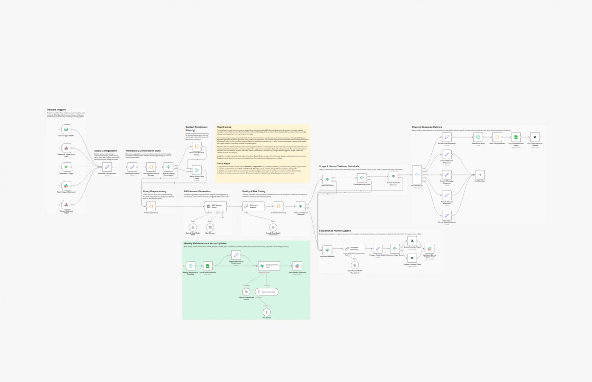
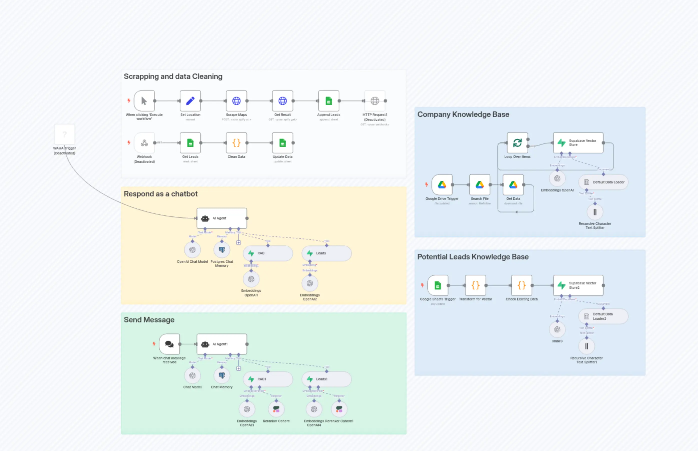
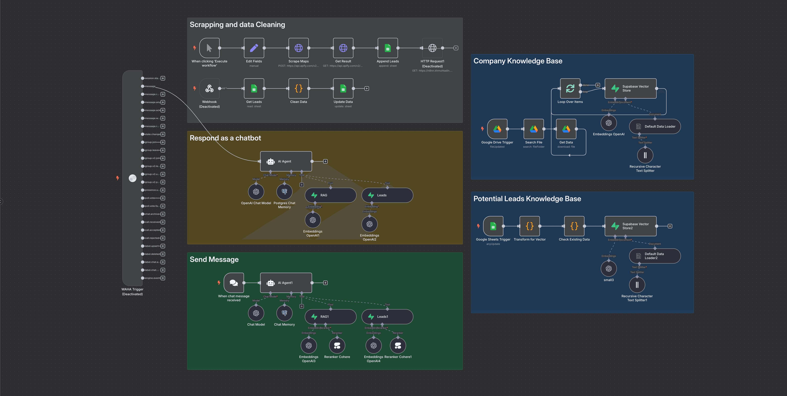
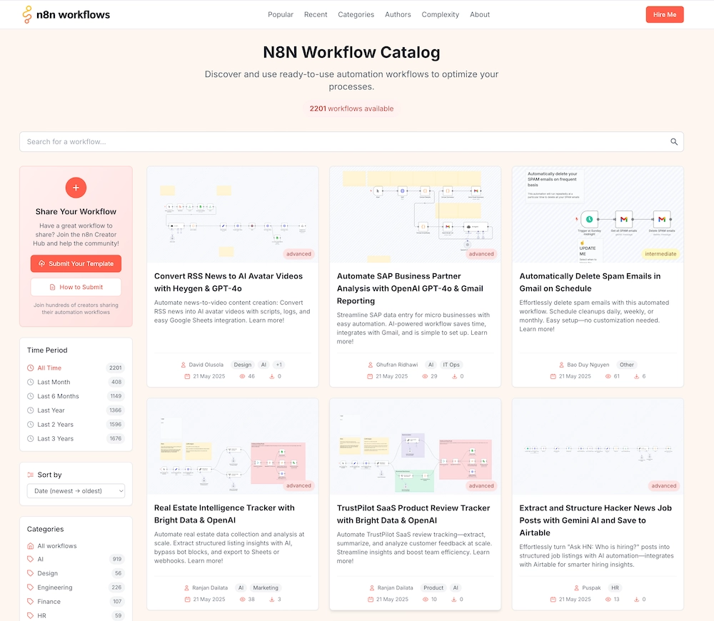

# Enhance Customer Support with RAG-Powered AI

Advanced n8n automation for Enhance Customer Support with RAG-Powered AI.

## Overview
- Category: Support Chatbot, AI RAG
- Complexity: advanced
- Source: n8n workflow template export

## What This Automation Does
Automate 24/7 customer support across Email, WhatsApp, Slack, & more with AI-powered, context-aware responses. Streamline queries & boost satisfactionlearn more!

## Included Files
- `workflow.json`

## Setup
1. Import `workflow.json` into n8n.
2. Configure required credentials for the services used in the workflow nodes.
3. Update any environment variables or static values inside nodes (API keys, URLs, IDs).
4. Run a test execution and then activate the workflow.

## Tech Stack

- `@n8n/n8n-nodes-langchain.agent`
- `@n8n/n8n-nodes-langchain.chainLlm`
- `@n8n/n8n-nodes-langchain.documentDefaultDataLoader`
- `@n8n/n8n-nodes-langchain.embeddingsOpenAi`
- `@n8n/n8n-nodes-langchain.lmChatOpenAi`
- `@n8n/n8n-nodes-langchain.memoryBufferWindow`
- `@n8n/n8n-nodes-langchain.textSplitterRecursiveCharacterTextSplitter`
- `@n8n/n8n-nodes-langchain.vectorStoreSupabase`
- `n8n-nodes-base.code`
- `n8n-nodes-base.emailReadImap`
- `n8n-nodes-base.emailSend`
- `n8n-nodes-base.googleSheets`
- `n8n-nodes-base.if`
- `n8n-nodes-base.merge`
- `n8n-nodes-base.noOp`
- `n8n-nodes-base.scheduleTrigger`
- `n8n-nodes-base.set`
- `n8n-nodes-base.slack`
- `n8n-nodes-base.slackTrigger`
- `n8n-nodes-base.stickyNote`
- `n8n-nodes-base.switch`
- `n8n-nodes-base.webhook`
- `n8n-nodes-base.whatsAppTrigger`
- `n8n-nodes-base.zendesk`

## Author

Murtaza Baig

## Screenshots

## License
MIT License. See `LICENSE`.